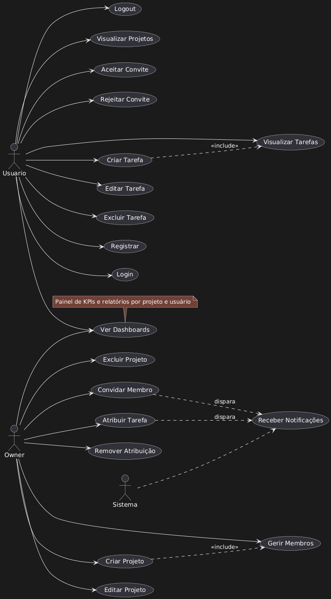
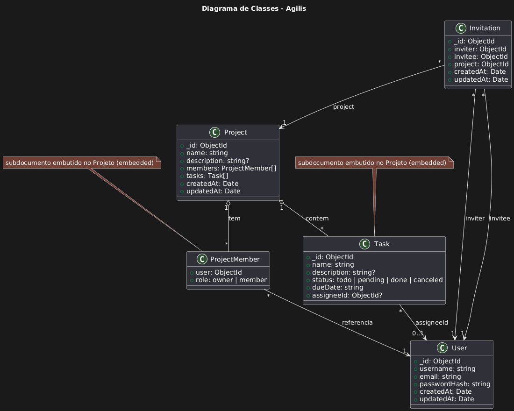
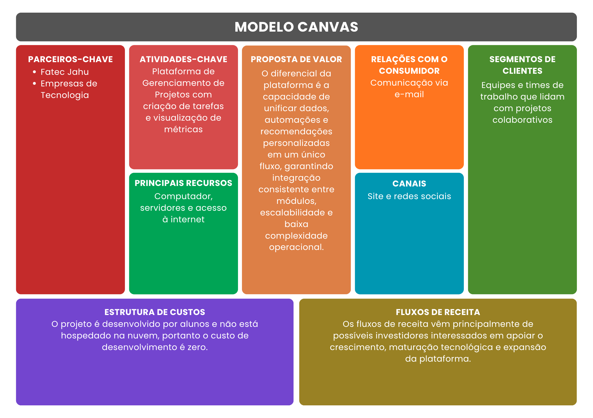
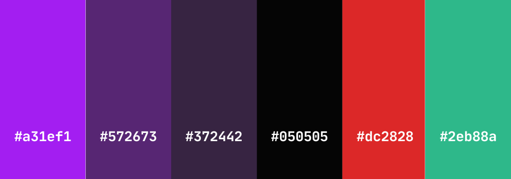
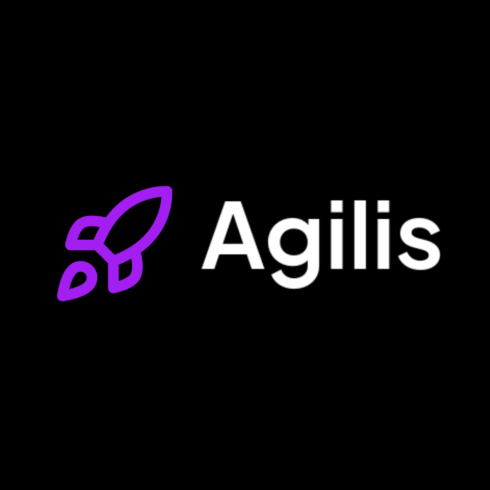
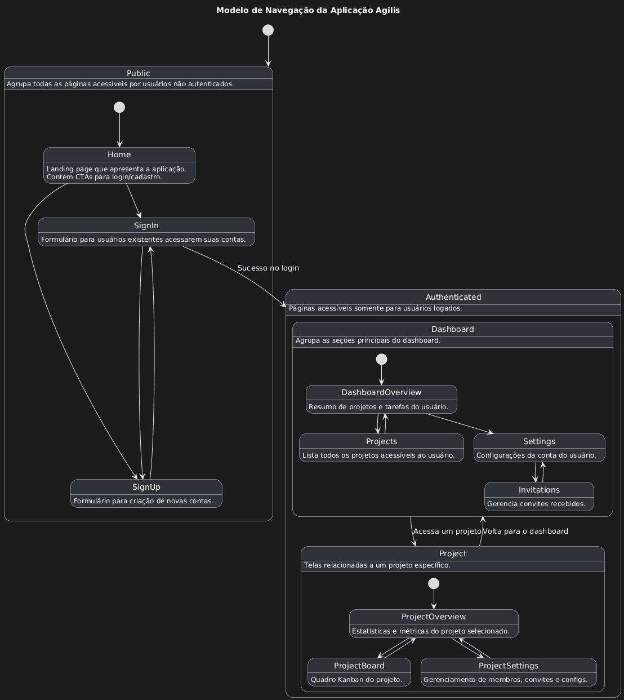

# Agilis

  
<strong>📑 Sumário</strong>

- [1. Introdução](#1-introdução)
  - [Objetivos](#-objetivos)
  - [Metodologia](#-metodologia)
- [2. Requisitos](#2-requisitos)
  - [Requisitos funcionais](#-requisitos-funcionais)
  - [Requisitos não funcionais](#-requisitos-não-funcionais)
- [3. Modelo de casos de uso](#3-modelo-de-casos-de-uso)
- [4. Modelo do banco de dados](#4-modelo-do-banco-de-dados)
- [5. Banco de dados](#5-banco-de-dados)
- [6. Diagrama de classes](#6-diagrama-de-classes)
- [7. Estudo de viabilidade](#7-estudo-de-viabilidade)
- [8. Regras de negócio (Modelo canvas)](#8-regras-de-negócio-modelo-canvas)
- [9. Design](#9-design)
- [10. Protótipo](#10-protótipo)
- [11. Aplicação](#11-aplicação)

# 1. Introdução

O Agilis é um app de gestão de tarefas focado em colaboração leve e direta entre usuários. A ideia é permitir que qualquer pessoa crie projetos, organize atividades e convide outros para contribuírem de forma simples, sem a complexidade de ferramentas de PM mais pesadas.

Ele nasce da necessidade de um fluxo mais rápido e acessível pra pequenos times, grupos de estudo e freelas que precisam se organizar sem burocracia. A proposta é entregar uma experiência minimalista, com foco total no que importa: projetos claros, membros definidos e tarefas que realmente andam.

## • Objetivos

O projeto tem como finalidade oferecer uma solução simples e colaborativa para o gerenciamento de projetos e tarefas, atendendo demandas de organização, comunicação e eficiência em pequenos grupos ou equipes.

1. Centralizar projetos e tarefas em um ambiente unificado.
2. Facilitar a colaboração entre usuários por meio do compartilhamento de projetos.
3. Simplificar o processo de gestão, evitando complexidade desnecessária.
4. Aprimorar a transparência e a eficiência nas atividades realizadas.

## • Metodologia

O desenvolvimento do sistema é conduzido com base no **Rational Unified Process** (RUP), um processo estruturado que organiza o trabalho em fases sequenciais e ciclos iterativos. Essa abordagem permitiu evolução progressiva do sistema, controle de riscos e integração contínua das funcionalidades ao longo do projeto.

## Processo de Desenvolvimento

Foram aplicadas as quatro fases principais do RUP:

1. Iniciação: definição do escopo, identificação dos requisitos essenciais e entendimento das necessidades do aplicativo de gestão de projetos e tarefas.
2. Elaboração: estruturação da arquitetura do sistema, modelagem das entidades centrais (usuários, projetos, tarefas) e mitigação dos principais riscos técnicos.
3. Construção: desenvolvimento incremental da API em Express, implementação da interface em React, integração com MongoDB e definição do fluxo de autenticação via JWT.
4. Transição: realização de testes funcionais, correção de inconsistências, ajustes de usabilidade e preparação do sistema para implantação.

As fases foram conduzidas de forma iterativa, permitindo revisões frequentes, refinamento das funcionalidades já existentes e integração gradual até a versão final do sistema.

## Tecnologias Utilizadas

- Backend: Express para implementação da API REST e da lógica de negócio.
- Banco de dados: MongoDB, utilizado pela flexibilidade da modelagem orientada a documentos.
- Frontend: React, responsável pela interface e interações do usuário.
- Autenticação: JWT para gerenciamento de sessões e controle de acesso.

## Ferramentas de Apoio

- GitHub: controle de versão e histórico de desenvolvimento.
- Postman: validação dos endpoints da API durante todo o processo.
- Docker: padronização do ambiente de execução e empacotamento dos serviços.
- Kubernetes: gerenciamento e orquestração dos contêineres nas etapas de implantação e testes de escalabilidade.

## Ambiente e Cronograma

O desenvolvimento ocorreu em ambiente local utilizando Docker e Kubernetes para simular cenários completos de execução. O avanço do projeto acompanhou as fases do RUP, com entregas iterativas que consolidaram e integraram cada funcionalidade até sua finalização.

# 2. Requisitos

## Requisitos funcionais
- Autenticação e gestão de conta: registro, login, logout, recuperação de senha e gerenciamento de perfil
- Gestão de projetos: criar, editar, visualizar e excluir projetos
- Gestão de membros: convidar, aceitar convite, listar, adicionar e remover membros
- Gestão de tarefas: criar, editar, excluir, visualizar e filtrar tarefas dentro de projetos
- Atribuição de tarefas: atribuir e remover responsáveis por tarefas
- Relatórios e dashboards: apresentar KPIs por projeto e por usuário
- Notificações: informar usuários sobre convites e mudanças relevantes

## Requisitos não funcionais

### Requisitos de produto
- Disponibilidade adequada para uso contínuo
- Desempenho responsivo nas principais interações
- Usabilidade clara e consistente na interface
- Segurança e privacidade dos dados dos usuários
- Escalabilidade para crescimento de usuários e dados

### Requisitos de organização
- Processos de desenvolvimento com revisão de código
- Pipelines de integração contínua e entrega contínua
- Papéis e responsabilidades definidos na equipe

### Requisitos de confiabilidade
- Alta disponibilidade e mecanismos de tolerância a falhas
- Monitoramento, logs e alertas operacionais

### Requisito de implementação
- Arquitetura modular e código tipado
- Documentação de interfaces e contratos de dados
- Automação de build testes e deploy
- Configuração gerenciada por variáveis de ambiente

### Requisito de padrões
- Convenções de codificação e práticas de linting aplicadas
- Versionamento semântico e política de compatibilidade
- Padrões de comunicação e uso consistente de códigos HTTP

### Requisitos de interoperabilidade
- Possibilidade de paginação, filtragem e ordenação padronizadas.
- Uso de formatos comuns para troca de dados
- Tolerância a variações de clientes (web, mobile, serviços terceiros).
- Versionamento previsível da API para evitar quebra de compatibilidade.

# 3. Modelo de casos de uso

# 4. Banco de dados

Este projeto usa MongoDB como sistema de persistência, acessado via Mongoose (ODM). Os modelos principais são armazenados como documentos no banco; `Project` contém subdocumentos para `members` e `tasks`, e `Invitation` é uma coleção separada para controlar convites pendentes.

# 5. Diagrama de classes

# 6. Estudo de viabilidade

## Objetivo
Apresentar a viabilidade do produto como um todo, contemplando arquitetura, dados, implantação, operação e qualidade.

## Visão Técnica e Arquitetural
- A solução usa tecnologias amplamente adotadas que favorecem produtividade e manutenção: TypeScript para segurança de tipos, Node.js para execução, MongoDB para persistência de documentos, e bibliotecas consolidadas para validação e autenticação.
- A arquitetura modular suporta desenvolvimento iterativo, deployment contínuo e escalonamento horizontal dos componentes quando necessário.

## Modelagem de Dados
- O modelo de documentos é adequado ao domínio de projetos e tarefas, permitindo consultas eficientes por projeto e operações atômicas no contexto do documento.
- A combinação de coleções e subdocumentos oferece flexibilidade para representar relações e otimizar leituras comuns.

## Implantação e Operação
- A plataforma é compatível com pipelines de integração e entrega contínua, deployment em contêineres e orquestração em ambientes gerenciados.
- Práticas de observabilidade (health checks) suportam operação previsível e respostas automatizadas a eventos de produção.

## Qualidade e Confiabilidade
- Adoção de tipagem, validação de entrada e testes automatizados contribui para estabilidade e manutenção segura do produto.
- Monitoramento e métricas permitem acompanhar a saúde do serviço e orientar decisões operacionais.

## Custos e Escalabilidade
- Custos podem ser dimensionados de acordo com uso, armazenamento e tráfego; a arquitetura favorece ajustes graduais de capacidade e recursos.

## Conclusão
- As escolhas tecnológicas e arquiteturais tornam o produto viável para desenvolvimento, implantação e operação em produção. A base atual oferece um caminho claro para crescimento e evolução conforme a demanda.

## Viabilidade

### Operacional
- Hospedagem e execução: ambiente local com Docker e Kubernetes (kind) — custo operacional imediato: zero.  
- Processos: integração contínua e deploy por contêineres, health checks e logs locais/centralizados para depuração em desenvolvimento.

### Técnica
- Requisitos de conformidade: não aplicáveis no escopo atual.  
- Volume alvo: estimativa baixa a média de uso — modelagem atual (documentos + subdocumentos) é adequada para esse patamar.  
- Integrações: poucas integrações essenciais previstas (aplicação simples); interfaces para e-mail/SMTP ou outras integrações podem ser adicionadas conforme necessidade.

### Cronograma
- Prazo alvo do MVP: 2 meses (desenvolvido em aproximadamente 65 dias).  
- Estado atual compatível com entrega rápida de incrementos e ciclos ágeis para evoluções futuras.

### Econômica & Financeira
- Custo do projeto no escopo atual: zero (projeto acadêmico, infraestrutura local com Docker + kind).  
- Caso no futuro seja necessário mover para ambientes gerenciados, custos e dimensionamento podem ser estimados com base em uso real.

# 7. Regras de negócio (Modelo canvas)

# 8. Design

## Paleta de Cores

A paleta do Agilis foi pensada para uma interface escura, com acentos vibrantes para ações principais e sinais claros para estados críticos. Abaixo estão as cores e recomendações de uso, acessibilidade e variações rápidas para estados (hover, foco, disabled).

### Cores Principais

- **Primary**: `#a31ef1`
  - Usada para elementos interativos principais, como botões primários e links importantes.

- **Secondary**: `#572673`
  - Usada para elementos de menor destaque, como badges e fundos secundários.

- **Accent**: `#372442`
  - Usada para indicar foco, hover e outros estados sutis em elementos interativos.

- **Background**: `#050505`
  - A cor de fundo principal da aplicação.

- **Destructive**: `#dc2828`
  - Usada para ações destrutivas, como botões de exclusão e alertas de erro.

- **Confirmação**: `#2eb88a`
  - Usada para ações de confirmação/sucesso, como confirmações de convite.

### Logo

A logo foi desenvolvida para comunicar velocidade, inovação e eficiência tecnológica. O conjunto visual utiliza o conceito de "propulsão" através da metáfora do foguete, alinhando-se semanticamente ao nome da marca. A estética adota o estilo Dark Mode para evocar modernidade.

### Wireframes

(...)

### Modelo de Navegação

# 9. Protótipo
(Gere um protótipo funcional na ferramenta que se sentir mais confortável (Figma, por exemplo) e apresente aqui, indicando o link).

# 10. Aplicação
